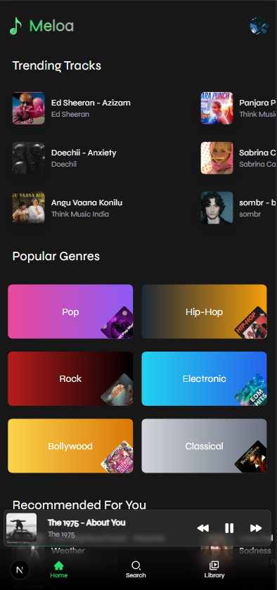
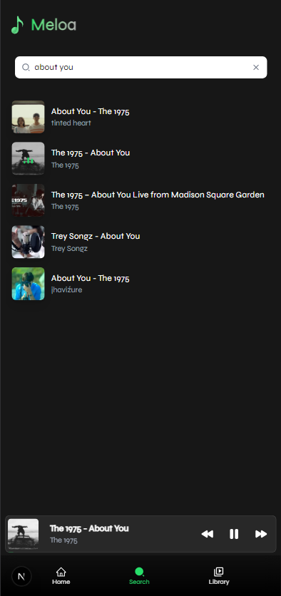
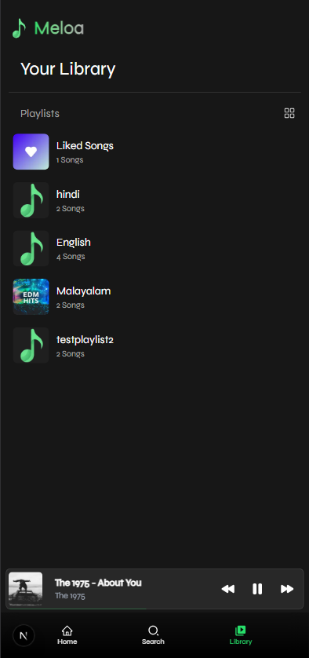
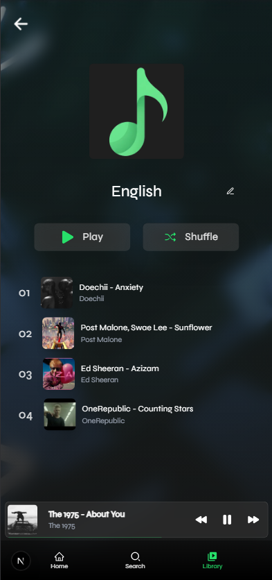
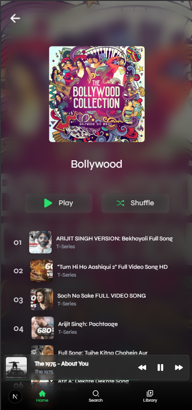

## Meloa

**Meloa** is an elegant and feature-rich music streaming and downloading platform designed to deliver a personalized audio experience. With a sleek interface and seamless performance, Meloa allows users to explore, enjoy and collect their favorite music from a vast and ever-growing library.  

## Features  

- **Search Music:** Easily search for any song fast results.  
- **Stream Music:** Play high-quality audio tracks with smooth, uninterrupted playback.  
- **Like Songs:** Mark your favorite songs for quick access and tailored recommendations.  
- **Create & Manage Playlists:** Build your own music collections and manage them effortlessly.  
- **Trending Songs:** Stay updated with the latest trending tracks across genres.  
- **Personalized Recommendations:** Get curated song suggestions based on your listening behavior.  
- **Download Music:** Download audio tracks directly for offline access.  

## Tech Stack  

- **Frontend:** Built using **Next.js** for a fast, SEO-optimized, and responsive UI.  
- **Backend:** Powered by **Express.js**, providing a scalable server-side architecture.  
- **Music Retrieval:**  
  - **youtubei.js:** Utilized for efficient music metadata extraction.  
  - **ytdl-core:** Used to fetch and stream/download high-quality audio directly from YouTube.  

## Installation  

### Prerequisites  
- Node.js v20 or above  
- npm or yarn  

### Clone the Repository  
```bash  
git clone https://github.com/DevaduttM/Meloa.git  
cd Meloa
```  
Install Dependencies
For the Frontend
```bash
cd frontend  
npm install
```  
For the Backend
```bash
cd ../backend  
npm install 
``` 
### Run the Application
Start the Backend Server
```bash
npm run dev  
```
Start the Frontend
```bash
cd ../frontend  
npm run dev  
```
The application will be running on http://localhost:3000 and will be ready to stream and download music.

## Screenshots

### Home Screen
<div>

</div>

### Search Screen
<div>

</div>

### Library Screen
<div>

</div>

### Player Screen
<div>

</div>

### Playlist Screen
<div>

</div>

### Genre Screen
<div>

</div>
